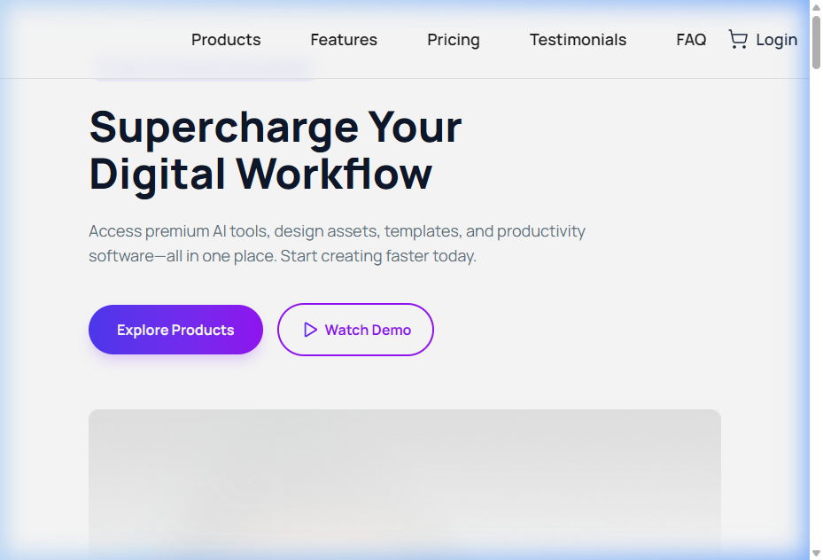

# 🚀 DigiTools - Premium Digital Marketplace

DigiTools is a high-performance, modern, and visually stunning digital products marketplace designed for creators and professionals. Built with a focus on seamless user experience, interactive animations, and a polished premium aesthetic.

---

## 📱 Project Preview


---

## 🛠️ Technology Stack & Dependencies

The project leverages modern frontend libraries and tools to deliver a responsive and scalable interface:

### Core Technologies
- **React.js (v19)**: Component-based architecture and robust state management.
- **Vite (v8)**: Ultra-fast next-generation frontend tool for development and bundling.
- **Tailwind CSS (v4)**: Modern CSS utility styling, customized gradients, and layouts.
- **daisyUI (v5)**: Clean, customizable UI components and styles.

### Project Dependencies
| Dependency | Version | Purpose |
| :--- | :--- | :--- |
| **`react`** | `^19.2.4` | Standard React library |
| **`react-dom`** | `^19.2.4` | DOM rendering interface for React |
| **`react-toastify`** | `^11.0.5` | Dynamic, real-time feedback toast notifications |
| **`lucide-react`** | `^1.8.0` | High-quality, vector-based custom iconography |
| **`tailwindcss`** | `^4.2.2` | CSS Framework for utility-first styling |
| **`@tailwindcss/vite`** | `^4.2.2` | Tailwind support for Vite integration |
| **`daisyui`** | `^5.5.19` | Tailwind components plug-in |
| **`eslint`** | `^9.39.4` | Code analysis and quality checks |

---

## ✨ Key Features

- **Interactive Sliding Navigation**: A custom-engineered tab system with smooth sliding animation transitions between the "Products" and "Cart" views.
- **Live Cart Integration**: A fully functional cart that dynamically calculates quantities and total prices, features instant item removal, and notifies the user via Toast alerts.
- **Real-Time Notification Badge**: A persistent navbar cart indicator updating in real-time as products are added/removed.
- **Premium Styling & Hover Effects**: Floating card translations (`hover:-translate-y-3`) and active button tactile feedback scaling (`active:scale-95`).
- **Interactive Pricing Matrix**: Detailed package tiers (Free, Pro, Enterprise) for a clear layout of customer offerings.
- **Responsive Layout**: Glassmorphism blurred navbar and clean grids optimized for mobile, tablet, and desktop viewports.

---

## 🚀 Getting Started

Follow these steps to run the project locally on your machine:

### Prerequisites
Make sure you have [Node.js](https://nodejs.org/) installed (v18+ recommended).

### Installation Steps
1. **Clone the repository:**
   ```bash
   git clone https://github.com/raihanuIR/DigiTools.git
   ```
2. **Navigate to the project directory:**
   ```bash
   cd DigiTools
   ```
3. **Install the dependencies:**
   ```bash
   npm install
   ```
4. **Run the local development server:**
   ```bash
   npm run dev
   ```
   *The application will start running. Access it on the URL shown in your console (usually `http://localhost:5173/` or similar).*

### Build & Production
- **Build production bundle:**
  ```bash
  npm run build
  ```
- **Preview production build locally:**
  ```bash
  npm run preview
  ```

---

## 🔗 Important Links

- **Live Site URL**: [https://raihanuir.github.io/DigiTools/](https://raihanuir.github.io/DigiTools/)
- **GitHub Repository**: [https://github.com/raihanuIR/DigiTools](https://github.com/raihanuIR/DigiTools)

---

## 👤 Developer Profile

**Raihanul Islam**
- 🎓 CSE Student at Bangladesh University of Business and Technology (BUBT)
- 💻 Web Developer specializing in React, JavaScript, and Tailwind CSS
- 📬 Connect on GitHub: [@raihanuIR](https://github.com/raihanuIR)
